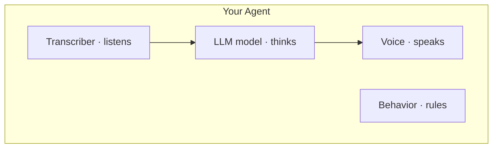

## What is an agent?

An **agent** is your voice AI caller — the complete package that handles a live conversation.

If the **LLM model** is the brain, the **agent** is the full person: ears, voice, greeting, and conversation rules.

| Part | Technical name | What it does |
| --- | --- | --- |
| Ears | **Transcriber (STT)** | Hears the user and converts speech → text |
| Brain | **LLM model** (`llm_id`) | Reads text and decides what to reply |
| Voice | **TTS** | Converts reply text → spoken audio |
| Behavior | **Call settings** | Greeting, when to hang up, max length |



---

## Create once, use many times

One agent can handle:

- Unlimited browser test calls
- Many outbound calls to different numbers
- Inbound calls on a shared phone line

**Personalize per call** with `variables` instead of creating a new agent each time:

```json
{
  "agent_id": "agent_abc123",
  "phone_number": "+14155559876",
  "variables": { "customer_name": "Sam", "order_id": "12345" }
}
```

Reference these in your system prompt: `"The customer's name is {{customer_name}}."`

---

## Key fields explained

### `llm_id` (required)

The ID of an LLM model you created with `POST /v1/models`. The agent loads its personality and instructions from that model.

### `transcriber` (required)

How the agent **listens**.

| Field | Meaning | Example |
| --- | --- | --- |
| `provider` | STT company | `deepgram` |
| `model` | Which model | `nova-3` |
| `language` | Expected spoken language | `en` |

### `tts` (required)

How the agent **speaks**.

| Field | Meaning | Example |
| --- | --- | --- |
| `provider` | TTS company | `deepgram` |
| `voice_id` | Which voice | `asteria` |
| `speed` | Speaking rate | `1.0` = normal |
| `stability` | Voice consistency | `0.5` |

See [Voices guide](/guides/voices) to list or import other voices.

### Behavior fields

| Field | What it does | Example |
| --- | --- | --- |
| `first_message` | First thing said when call connects | `"Hi! How can I help?"` |
| `end_call_phrases` | User says these → call ends | `["goodbye", "bye"]` |
| `silence_timeout_seconds` | Hang up after N seconds of silence | `10` |
| `max_duration_seconds` | Hard cap on call length | `600` (10 min) |

---

## Full create example

See **[Build your first agent](/quickstart/first-agent)** step 4 for a copy-paste example, or [Create agent](/api-reference/agents/create-agent) in the API reference.

---

## Update an agent

Change voice, greeting, or link a different LLM without recreating:

```bash
curl -X PATCH https://api.oneinbox.ai/v1/agents/<agent_id> \
  -H "Authorization: Bearer <api_key>" \
  -H "Content-Type: application/json" \
  -d '{
    "first_message": "Hello! Thanks for calling Acme Support."
  }'
```

---

## Next steps

- **[Build your first agent](/quickstart/first-agent)** — create your first agent
- **[Phone calls](/quickstart/phone-calls)** — use your agent on real numbers
- **[LLM models](/api-reference/llm-models/create-llm-model)** — change the brain
