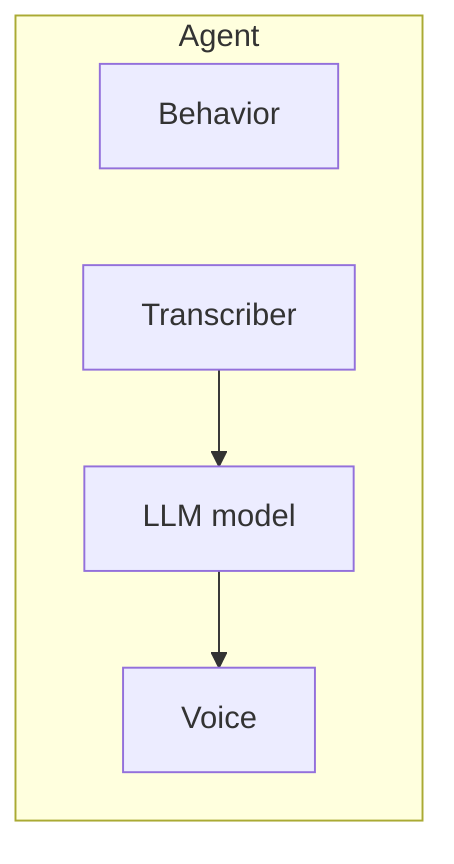

## What is an agent?

An **Agent** is your voice AI caller. It combines:

| Part | Role | You set |
| --- | --- | --- |
| **Transcriber (STT)** | Listens — converts speech to text | Provider, model, language |
| **LLM model** | Thinks — generates replies | Linked via `llm_id` |
| **TTS voice** | Speaks — converts text to audio | Provider, voice_id, speed |
| **Call behavior** | Conversation rules | `first_message`, timeouts, end phrases |

---

## Key settings

| Field | What it does |
| --- | --- |
| `first_message` | What the agent says when the call connects |
| `end_call_phrases` | User says these → call ends ("goodbye", "bye") |
| `silence_timeout_seconds` | End call after N seconds of silence |
| `max_duration_seconds` | Hard cap on call length |

---

## One agent, many calls

A single agent handles unlimited concurrent calls. Use `variables` on each call to personalize without creating new agents.

---

## Create an agent

See the full example in **[Build your first agent](/quickstart/first-agent)** step 4, or [Create agent](/api-reference/agents/create-agent).

---

## Next steps

- **[Phone calls](/quickstart/phone-calls)** — outbound and inbound with real numbers
- **[Build your first agent](/quickstart/first-agent)** — browser test walkthrough
- **[Create LLM model](/api-reference/llm-models/create-llm-model)** — configure the brain
