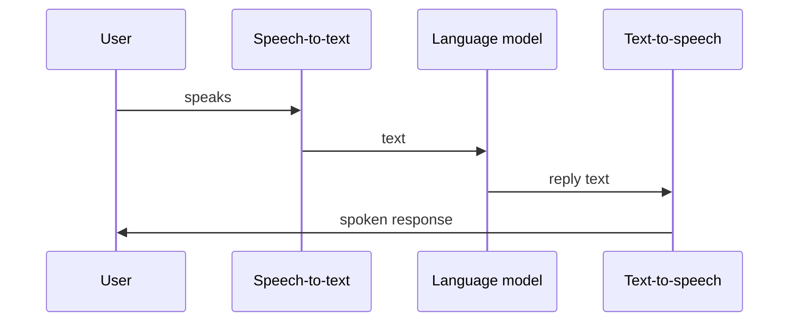

## The loop

On every call, audio cycles through three stages:

| Stage | You configure |
| --- | --- |
| **STT** | Provider, model, language |
| **LLM** | Model, system prompt, tools, knowledge bases |
| **TTS** | Provider, voice, speed |

OneInbox handles streaming, turn-taking, and call control.

---

## What OneInbox runs for you

- Real-time audio between STT, LLM, and TTS
- End-of-speech detection
- Silence timeout and end phrases
- Transcripts and call metadata
- Telephony routing for phone calls
- Web call session tokens (`server_url`, `participant_token`)

You do **not** run WebRTC servers or SIP infrastructure yourself.

---

## Call types

| Type | What it is | Guide |
| --- | --- | --- |
| **Web call** | API session via `POST /v1/calls/web` | [Web calls](/guides/web-calls) |
| **Web SDK** | Browser client that joins a web call | [Web SDK](/concepts/web-sdk) |
| **Outbound phone** | Agent dials a number | [Phone calls](/guides/phone-calls) |
| **Inbound phone** | Caller reaches your number | [Phone calls](/guides/phone-calls) |

---

## One agent, many calls

Create once. Pass per-call context with `variables` — no need to clone agents.

---

## Next steps

- **[Quickstart](/guides/quickstart)**
- **[Agents](/concepts/agents)**
