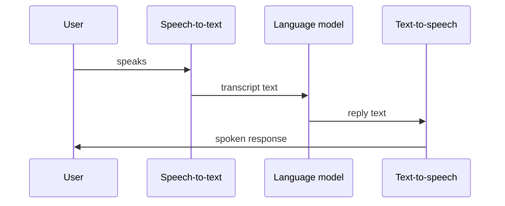

## The voice pipeline

When someone talks to your agent, audio flows through three stages in a loop until the call ends:

| Stage | Input | Output | You configure |
| --- | --- | --- | --- |
| **STT** | Audio | Text | Provider, model, language |
| **LLM** | Text | Text | Model, system prompt, tools, KB |
| **TTS** | Text | Audio | Provider, voice, speed |

OneInbox handles streaming, latency optimization, and call control between stages.

---

## What OneInbox manages for you

You don't run WebRTC servers, SIP trunks, or audio pipelines. OneInbox:

- Streams audio in real time (target: under 700ms voice-to-voice)
- Detects when the user stops speaking (turn-taking)
- Ends the call on silence timeout or end phrases
- Records transcripts and call metadata
- Routes phone calls via Twilio when needed

You focus on **what the agent says** (prompt, tools, voice settings).

---

## One agent, many calls

Create an agent once. Use it for:

- Outbound campaigns to different numbers
- Inbound on a shared phone line
- Browser test calls during development

Pass per-call context via `variables` instead of cloning agents.

---

## Learn more

- **[Resources](/concepts/resources)** — how API objects connect
- **[Agents](/concepts/agents)** — STT, TTS, and call behavior
- **[Build your first agent](/quickstart/first-agent)** — hands-on walkthrough
