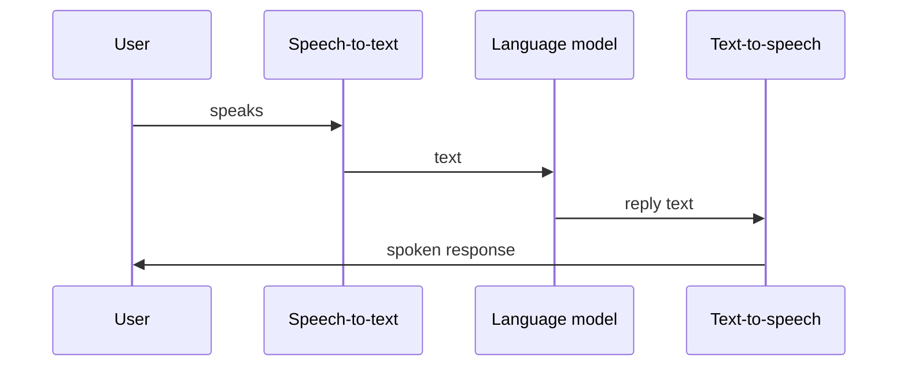

## The loop

On every call, audio goes through three steps in a loop:

| Stage | You configure |
| --- | --- |
| **STT** | Provider, model, language |
| **LLM** | Model, system prompt, tools, knowledge bases |
| **TTS** | Provider, voice, speed |

OneInbox handles streaming, turn-taking, and call control. You focus on **what the agent says**.

---

## What OneInbox runs for you

- Real-time audio streaming between STT, LLM, and TTS
- Detecting when the user stops speaking
- Ending the call on silence timeout or end phrases
- Saving transcripts and call metadata
- Routing phone calls through Twilio

You do **not** run WebRTC servers, SIP trunks, or audio pipelines.

---

## One agent, many calls

Create an agent once. Reuse it for:

- Browser test calls (dev)
- Outbound campaigns to different numbers
- Inbound on a shared phone line

Pass per-call data with `variables` — no need to clone agents.

---

## Next

- **[Build your first agent](/quickstart/first-agent)** — 5-step walkthrough
- **[Resources](/concepts/resources)** — how API objects connect
- **[Agents](/concepts/agents)** — STT, TTS, and call behavior
