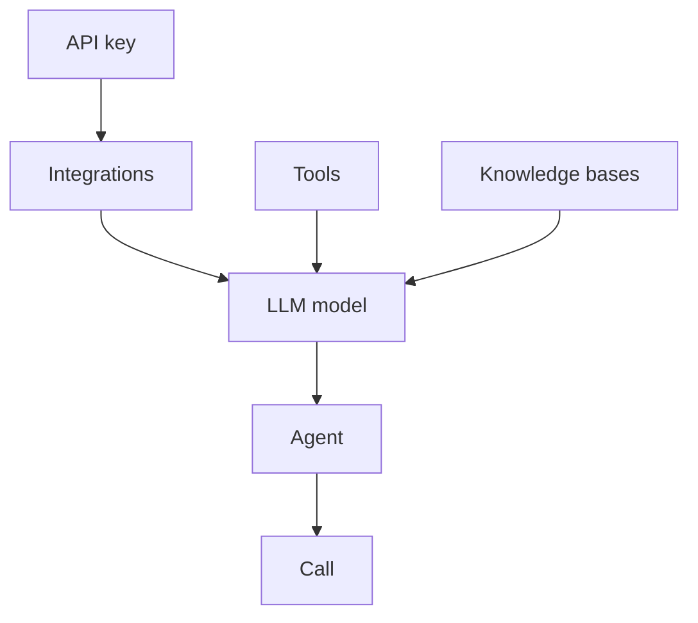

## Start here: 5 steps

| # | Resource | Endpoint | Save |
| --- | --- | --- | --- |
| 1 | API key | OneInbox dashboard → **API Keys** | `api_key` |
| 2 | Integration | `POST /v1/credentials` | `credential_id` |
| 3 | LLM model | `POST /v1/models` | `llm_id` |
| 4 | Agent | `POST /v1/agents` | `agent_id` |
| 5 | Call | `POST /v1/calls/web` or `POST /v1/calls` | `call_id` |

→ **[Follow the walkthrough](/quickstart/first-agent)**

---

## How they connect

| From | To | How |
| --- | --- | --- |
| Integration | LLM model | `"provider": "openai"` uses stored OpenAI key |
| Tools / KB | LLM model | `tool_ids`, `knowledge_base_ids` |
| LLM model | Agent | `llm_id` |
| Agent | Call | `agent_id` |
| Integration (Twilio) | Phone number | `credential_id` on search/register |
| Phone number | Agent | `agent_id` for inbound routing |

<Info>
Integration IDs appear as `credential_id` in some fields. Same thing.
</Info>

---

## All resources

| Resource | Guide | When |
| --- | --- | --- |
| API key | [Authentication](/concepts/authentication) · Dashboard | Once |
| Integrations | [Integrations](/concepts/integrations) | OpenAI, Twilio, ElevenLabs, … |
| LLM Models | [Quickstart step 3](/quickstart/first-agent) | Every agent |
| Agents | [Quickstart step 4](/quickstart/first-agent) | Every agent |
| Calls | [Quickstart](/quickstart/first-agent) · [Phone](/quickstart/phone-calls) | Start conversations |
| Phone Numbers | [Phone calls](/quickstart/phone-calls) | Inbound lines |
| Tools | [Tools guide](/guides/tools) | API actions, transfer |
| Webhooks | [Webhooks guide](/guides/webhooks) | Server events |
| Knowledge Bases | [KB guide](/guides/knowledge-bases) | Answer from docs |
| Voices | [Voices guide](/guides/voices) | Custom TTS |
| Health | [Health check](/api-reference/health/health-check) | Status ping |

---

## Next

- **[Build your first agent](/quickstart/first-agent)**
- Switch to the **API Reference** tab for Try It on every endpoint
