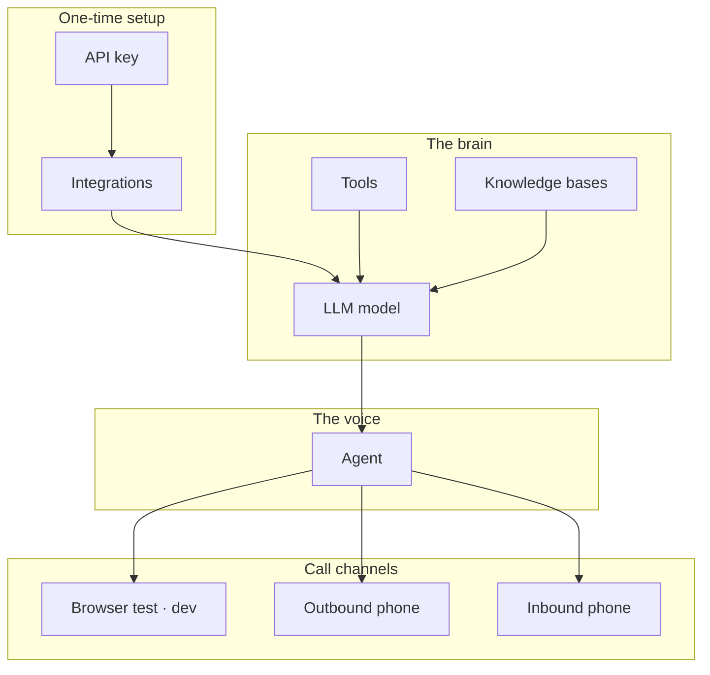

## The big picture

OneInbox resources are **composable**. You create building blocks, then wire them into an agent and a call.



---

## Build order

For your first agent, create resources in this order:

| Order | Resource | Required? | Purpose |
| --- | --- | --- | --- |
| 1 | API key | Yes | Authenticates your requests |
| 2 | Integration | Yes (OpenAI) | Stores provider API keys |
| 3 | LLM model | Yes | Brain — prompt + model |
| 4 | Agent | Yes | STT + LLM + TTS bundle |
| 5 | Call | Yes | Starts a conversation |

Optional (add as you grow):

| Resource | Purpose |
| --- | --- |
| **Tools** | Let the agent call your APIs (book appointment, lookup order) |
| **Webhooks** | Receive events when calls start, end, or tools run |
| **Knowledge bases** | Answer questions from your docs |
| **Voices** | Import custom ElevenLabs voices |
| **Phone numbers** | Inbound/outbound telephony via Twilio |

---

## How resources reference each other

```
Integration (OpenAI)  ──►  used by LLM model
Integration (Twilio)  ──►  used by phone number search/register
Integration (ElevenLabs) ──► used by custom voice import

LLM model  ──►  referenced by agent via llm_id
Tools, KB  ──►  attached to LLM model via tool_ids, knowledge_base_ids

Agent  ──►  referenced by call via agent_id
Phone number  ──►  maps inbound calls to agent_id
```

<Info>
Integration IDs appear as `credential_id` in some API fields. Same thing — stored provider key.
</Info>

---

## Next steps

- **[Build your first agent](/quickstart/first-agent)** — follow the build order hands-on
- **[Integrations](/concepts/integrations)** — supported providers
- Switch to the **API Reference** tab for all endpoints
