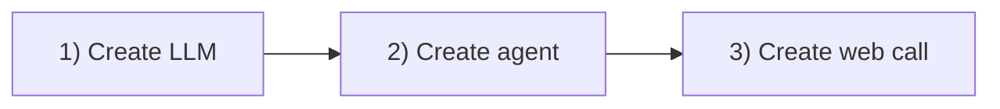

## Overview

In about 15 minutes you will create a working voice agent and start a **web call**. You do not need a phone number, telephony carrier, or third-party API keys.

**You will:**

1. Create an **LLM model**
2. Create an **agent**
3. Create a **web call** with `POST /v1/calls/web`

**Time:** ~15 minutes

Every API request uses:

```
Authorization: Bearer <api_key>
```



---

## Prerequisites

| Item | Where |
| --- | --- |
| **OneInbox API key** | [Dashboard](https://oneinbox-dashboard.vercel.app) → **API Keys** → **Create API key** |
| **Terminal** | `curl` (Mac Terminal, Windows PowerShell, or WSL) |

Copy your API key and use `Authorization: Bearer <api_key>` in every curl below. More detail → [Authentication](/concepts/authentication)

**How to run each step:** open Terminal (Mac), PowerShell, or WSL. Copy the curl command, replace every placeholder (e.g. `<api_key>` → your real key), paste into the terminal, and press Enter. If the response is JSON with an `"id"` field, the step worked.

You do **not** need a phone number or vendor integrations. [Integrations](/concepts/integrations) are optional when you want your own provider billing (BYOK) or a telephony carrier.

---

## 1) Create an LLM

Define **how your agent thinks** — default LLM and system prompt. The agent in step 2 references this model via `llm_id`. You can reuse one LLM across many agents.

| Field | Meaning | This guide |
| --- | --- | --- |
| `name` | Label in your dashboard | `"My First Model"` |
| `provider` | LLM settings | Default LLM |
| `model` | LLM settings | Default LLM |
| `system_prompt` | Instructions the agent follows | Personality and rules |
| `temperature` | Creativity (0 = strict, 1 = creative) | `0.7` |
| `tool_ids` | Attached tools | `[]` for now |
| `knowledge_base_ids` | Attached knowledge bases | `[]` for now |

```bash
curl -X POST https://api.oneinbox.ai/v1/models \
  -H "Authorization: Bearer <api_key>" \
  -H "Content-Type: application/json" \
  -d '{
    "name": "My First Model",
    "provider": "openai",
    "model": "gpt-4.1-mini",
    "system_prompt": "You are a friendly assistant. Keep every response under two sentences. Be warm and direct.",
    "temperature": 0.7,
    "max_tokens": 4000,
    "tool_ids": [],
    "knowledge_base_ids": []
  }'
```

```json
{
  "id": "model_abc123",
  "name": "My First Model",
  "system_prompt": "You are a friendly assistant...",
  "temperature": 0.7,
  "created_at": "2026-01-15T10:02:00Z"
}
```

| Error | Meaning | Fix |
| --- | --- | --- |
| `401` | Bad API key | Copy the full key from the dashboard |
| `400` | Invalid model config | Match the JSON above |

Copy the `"id"` value from the response (e.g. `model_abc123`). You will paste it as `<llm_id>` in step 2.

---

## 2) Create an agent

Assemble the full **voice agent** — STT, LLM, TTS, and call behavior. Link the LLM from step 1 with `llm_id`.

Replace `<llm_id>` in the curl below with the `"id"` you copied from step 1.

| Part | Field | This guide |
| --- | --- | --- |
| Brain | `llm_id` | From step 1 |
| Ears (STT) | `transcriber` | Default STT |
| Voice (TTS) | `tts` | Default voice |
| Behavior | `first_message`, timeouts | Greeting and hang-up rules |

| Field | What it does |
| --- | --- |
| `first_message` | First thing said when the call connects |
| `end_call_phrases` | User says these → call ends |
| `silence_timeout_seconds` | Hang up after N seconds of silence |
| `max_duration_seconds` | Hard cap on call length |
| `interruption_sensitivity` | How easily the user can interrupt (0.0–1.0) |
| `enable_recording` | Record the call when `true` |

```bash
curl -X POST https://api.oneinbox.ai/v1/agents \
  -H "Authorization: Bearer <api_key>" \
  -H "Content-Type: application/json" \
  -d '{
    "name": "Support Agent",
    "llm_id": "<llm_id>",
    "transcriber": {
      "provider": "deepgram",
      "model": "nova-3",
      "language": "en"
    },
    "tts": {
      "provider": "deepgram",
      "voice_id": "asteria",
      "speed": 1.0,
      "stability": 0.5
    },
    "first_message": "Hi! How can I help you today?",
    "end_call_phrases": ["goodbye", "bye", "that is all"],
    "silence_timeout_seconds": 10,
    "max_duration_seconds": 600,
    "interruption_sensitivity": 0.6,
    "enable_recording": false
  }'
```

```json
{
  "id": "agent_abc123",
  "name": "Support Agent",
  "llm_id": "model_abc123",
  "first_message": "Hi! How can I help you today?",
  "created_at": "2026-01-15T10:03:00Z"
}
```

| Error | Meaning | Fix |
| --- | --- | --- |
| `404` on llm_id | Wrong LLM ID | Re-copy from step 1 |
| `400` | Invalid transcriber/tts | Use the JSON above |

Copy the `"id"` value from the response (e.g. `agent_abc123`). You will paste it as `<agent_id>` in step 3.

---

## 3) Create a web call

Create a **web call** — a voice session on OneInbox's servers. This step uses the API only (`POST /v1/calls/web`). It returns a `call_id` you can poll for status and transcript.

Replace `<agent_id>` with the `"id"` you copied from step 2.

```bash
curl -X POST https://api.oneinbox.ai/v1/calls/web \
  -H "Authorization: Bearer <api_key>" \
  -H "Content-Type: application/json" \
  -d '{
    "agent_id": "<agent_id>",
    "variables": { "customer_name": "Guest" }
  }'
```

```json
{
  "id": "call_abc123",
  "server_url": "wss://voice.oneinbox.ai",
  "participant_token": "eyJhbGciOiJIUzI1NiIsInR5cCI6IkpXVCJ9..."
}
```

| Field | Meaning |
| --- | --- |
| `id` | Call ID — poll with `GET /v1/calls/<call_id>` |
| `server_url` | WebSocket URL (for browser voice via Web SDK) |
| `participant_token` | Client token for Web SDK — not your API key |

| Error | Meaning | Fix |
| --- | --- | --- |
| `404` on agent_id | Wrong agent ID | Re-copy from step 2 |

**Are you done?** If the response includes `"id"`, `"server_url"`, and `"participant_token"`, the web call session was created successfully. This step does **not** open your microphone yet — it only creates the session on OneInbox.

To **hear and speak** with your agent in a browser, continue to the [Web SDK](/concepts/web-sdk). To check call status later:

```bash
curl https://api.oneinbox.ai/v1/calls/<call_id> \
  -H "Authorization: Bearer <api_key>"
```

Wait for `"status": "completed"` to read the `transcript`.

---

## Next steps

Add a **phone number** and call real lines — [Phone calls](/guides/phone-calls).

<CardGroup cols={2}>
  <Card title="Phone calls" icon="phone" href="/guides/phone-calls">
    Add a telephony carrier, register a number, outbound and inbound
  </Card>
  <Card title="Integrations" icon="key" href="/concepts/integrations">
    Store your carrier credentials in OneInbox
  </Card>
  <Card title="Web SDK" icon="globe" href="/concepts/web-sdk">
    Browser voice for web calls
  </Card>
  <Card title="Tools" icon="wrench" href="/guides/tools">
    API actions, transfer, hang up
  </Card>
</CardGroup>
