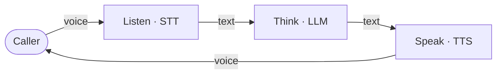

OneInbox is the developer platform for building **voice AI agents**. You define the conversation — we handle telephony, streaming, and scaling.

Voice agents let you:

- Have **natural spoken conversations** over the phone in real time
- Run **outbound campaigns** — your agent dials leads and qualifies them
- Answer **inbound calls** 24/7 on a phone number you assign
- **Test in the browser** during development (via a meet link — not a product embed yet)

---

## How voice agents work

Every OneInbox agent combines three core technologies:

| Layer | What it does | Example providers |
| --- | --- | --- |
| **Speech-to-text (STT)** | Converts what the user says into text | Deepgram |
| **LLM** | Reads the text and decides what to say | OpenAI, Gemini |
| **Text-to-speech (TTS)** | Speaks the reply in a natural voice | Deepgram, Cartesia, ElevenLabs |

OneInbox orchestrates all three in a streaming pipeline so the conversation feels human — typically under 700ms voice-to-voice.



You pick the provider at each layer. Mix and match.

---

## Production vs development

| Channel | Status | Use for |
| --- | --- | --- |
| **Outbound phone** | Available | Sales, reminders, lead qualification |
| **Inbound phone** | Available | Support lines on your Twilio number |
| **Browser test call** | Available | Dev/demo only — open a meet link to hear your agent |
| **Embed in your app/website** | Not available yet | Coming later |

---

## Choose your path

<CardGroup cols={2}>
  <Card title="Build your first agent" icon="rocket" href="/quickstart/first-agent">
    **Start here.** Create an API key, connect OpenAI, and test your agent in the browser in ~5 minutes.
  </Card>
  <Card title="Phone calls" icon="phone" href="/quickstart/phone-calls">
    Outbound and inbound calling with Twilio phone numbers.
  </Card>
  <Card title="API reference" icon="code" href="/api-reference/auth/sign-up">
    Interactive endpoint docs with Try It — like Vapi.
  </Card>
</CardGroup>

---

## What you can build today

<AccordionGroup>
  <Accordion title="Outbound AI caller">
    Your agent dials leads, qualifies them, books appointments, and logs results to your CRM.
  </Accordion>
  <Accordion title="Inbound support line">
    Assign a phone number. Callers reach your AI 24/7 — with tools to look up orders, book slots, or escalate to a human.
  </Accordion>
</AccordionGroup>

---

## The 5 resources you'll create first

Before your first call, you create five things **in this order**:

```
API key  →  Integration  →  LLM model  →  Agent  →  Call
```

| # | Resource | One sentence |
| --- | --- | --- |
| 1 | **API key** | Authenticates every request you make to OneInbox |
| 2 | **Integration** | Stores your OpenAI (or other) API key securely |
| 3 | **LLM model** | The brain — system prompt, model name, tools |
| 4 | **Agent** | STT + LLM + TTS assembled into a voice caller |
| 5 | **Call** | Starts a live conversation (browser test or phone) |

<Info>
We call stored provider keys **Integrations** in these docs. The API path is `/v1/credentials`.
</Info>

Ready? → **[Build your first agent](/quickstart/first-agent)**
