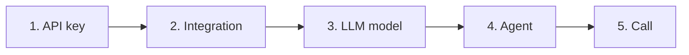
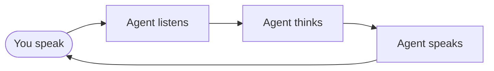

## What is OneInbox?

OneInbox is the API for **voice AI agents** — software that listens, replies, and speaks on phone or browser calls.

You configure the agent with a few API calls. OneInbox handles audio streaming and telephony.

<Card title="Build your first agent" icon="rocket" href="/quickstart/first-agent">
  Step-by-step walkthrough: API key → OpenAI → LLM → agent → browser test call.
</Card>

<Card title="API reference" icon="code" href="/api-reference/auth/sign-up">
  Try every endpoint in the browser with interactive examples.
</Card>

---

## What you'll build (end result)

By the end of the quickstart you will have:

- A OneInbox account
- An agent named something like **Alex** that talks in English
- A **browser test call** where you speak to Alex through your microphone

You will **not** need a phone number for the first guide. Phone calls come later.

---

## Key terms (read before you start)

If you've never built with APIs before, these words appear everywhere:

| Term | Plain English |
| --- | --- |
| **API** | A way for your code (or terminal) to talk to OneInbox over the internet |
| **API key** | Your permanent password for OneInbox. Starts with `oi_live_...`. Use it in every request after step 1 |
| **JWT / access_token** | A temporary login token. You only use it once — to create your API key |
| **Integration** | Your OpenAI (or Twilio) key stored safely inside OneInbox. API path: `/v1/credentials` |
| **LLM model** | The "brain" — which GPT model to use and what instructions it follows (system prompt) |
| **Agent** | The full voice caller: ears (STT) + brain (LLM) + voice (TTS) + behavior (greeting, timeouts) |
| **STT** | Speech-to-text — converts what the user **says** into text |
| **TTS** | Text-to-speech — converts the agent's **reply** into spoken audio |
| **Call** | A live conversation. Browser test = dev demo. Phone call = real number via Twilio |

<Info>
In these docs we say **Integration**. In API responses and some fields you'll see `credential_id` — same thing.
</Info>

---

## The 5 steps (do them in order)

Think of it like assembling LEGO blocks. Each step creates one block. Later steps need IDs from earlier steps.

| Step | You create | Why | Save this ID |
| --- | --- | --- | --- |
| **1** | Account + API key | Proves requests are from you | `api_key` |
| **2** | OpenAI integration | So OneInbox can call OpenAI on your behalf | `credential_id` (optional in basic flow) |
| **3** | LLM model | Defines personality and which GPT model to use | `llm_id` |
| **4** | Agent | Wires listening + brain + speaking together | `agent_id` |
| **5** | Browser test call | Opens a page where you talk to your agent | meet link |

**Rule:** After step 1, every request uses `Authorization: Bearer <api_key>`. The JWT from signup is **not** used again.

---

## What happens during a call

When someone talks to your agent, this loop runs until the call ends:

You choose the providers (e.g. Deepgram for voice, OpenAI for brain). OneInbox connects them in real time.

---

## Choose your path

<CardGroup cols={2}>
  <Card title="First agent (start here)" icon="rocket" href="/quickstart/first-agent">
    Full walkthrough — browser test, no phone needed
  </Card>
  <Card title="Phone calls" icon="phone" href="/quickstart/phone-calls">
    Real outbound/inbound calls — do the first guide first
  </Card>
  <Card title="Authentication explained" icon="key" href="/concepts/authentication">
    Why there are two tokens and how to avoid 401 errors
  </Card>
  <Card title="API reference" icon="code" href="/api-reference/auth/sign-up">
    Every endpoint with Try It — test requests in the browser
  </Card>
</CardGroup>

### Optional (after your first call)

<CardGroup cols={2}>
  <Card title="Tools" icon="wrench" href="/guides/tools">
    Agent can call your API, transfer, or hang up
  </Card>
  <Card title="Webhooks" icon="webhook" href="/guides/webhooks">
    Your server gets notified when calls start/end
  </Card>
  <Card title="Knowledge bases" icon="book" href="/guides/knowledge-bases">
    Agent answers from your docs
  </Card>
  <Card title="Voices" icon="microphone" href="/guides/voices">
    Change or import custom voices
  </Card>
</CardGroup>

---

## All API resources

| Resource | Guide | When you need it |
| --- | --- | --- |
| Auth | [Sign up](/api-reference/auth/sign-up) | Once — create account |
| API Keys | [Create key](/api-reference/api-keys/create-api-key) | Once — get `api_key` |
| Integrations | [Concepts](/concepts/integrations) | Store OpenAI, Twilio keys |
| LLM Models | [Quickstart step 3](/quickstart/first-agent) | Every agent |
| Agents | [Quickstart step 4](/quickstart/first-agent) | Every agent |
| Calls | [Quickstart](/quickstart/first-agent) | Start conversations |
| Phone Numbers | [Phone calls](/quickstart/phone-calls) | Inbound lines |
| Tools | [Guide](/guides/tools) | Extra agent actions |
| Webhooks | [Guide](/guides/webhooks) | Server notifications |
| Knowledge Bases | [Guide](/guides/knowledge-bases) | Doc Q&A |
| Voices | [Guide](/guides/voices) | Custom TTS |
| Health | [Health check](/api-reference/health/health-check) | Ping the API |
