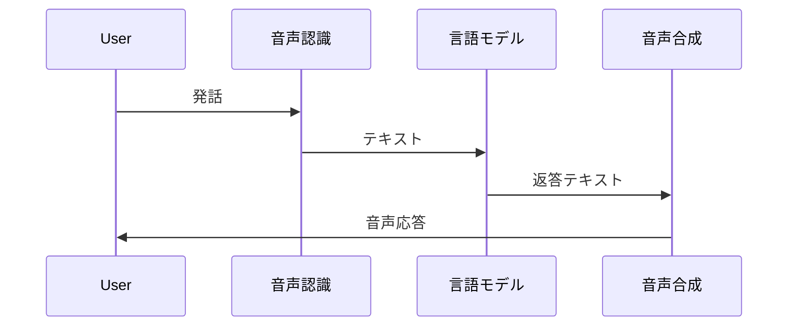

## ループ

すべての通話で、音声は 3 段階を循環します:

| 段階 | 設定内容 |
| --- | --- |
| **STT** | プロバイダー、モデル、言語 |
| **LLM** | モデル、システムプロンプト、ツール、ナレッジベース |
| **TTS** | プロバイダー、ボイス、速度 |

OneInbox がストリーミング・ターンテイキング・通話制御を担当します。

---

## OneInbox が担うもの

- STT / LLM / TTS 間のリアルタイム音声
- 発話終了の検出
- 無音タイムアウト・終了フレーズ
- トランスクリプトとメタデータ
- 電話通話のテレフォニールーティング
- Web 通話セッショントークン（`server_url`、`participant_token`）

WebRTC サーバーや SIP インフラを **自前で運用する必要はありません**。

---

## 通話の種類

| 種類 | 内容 | ガイド |
| --- | --- | --- |
| **Web 通話** | `POST /v1/calls/web` の API セッション | [Web 通話](/jp/guides/web-calls) |
| **Web SDK** | Web 通話にブラウザから接続 | [Web SDK](/jp/concepts/web-sdk) |
| **アウトバウンド電話** | エージェントが番号に発信 | [電話通話](/jp/guides/phone-calls) |
| **インバウンド電話** | 発信者が自社番号に着信 | [電話通話](/jp/guides/phone-calls) |

---

## 1 エージェント、多数の通話

1 回作成すれば十分。通話ごとに `variables` でコンテキストを渡せます — エージェントを複製する必要はありません。

---

## 次のステップ

- **[クイックスタート](/jp/guides/quickstart)**
- **[エージェント](/jp/concepts/agents)**
