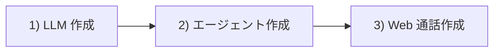

## 概要

約 15 分で動作する音声エージェントを作成し、**Web 通話**を開始します。電話番号・テレフォニーキャリア・サードパーティ API キーは不要です。

**行うこと:**

1. **LLM モデル**を作成
2. **エージェント**を作成
3. `POST /v1/calls/web` で **Web 通話**を作成

**所要時間:** 約 15 分

すべてのリクエスト:

```
Authorization: Bearer <api_key>
```



---

## 前提条件

| 項目 | 取得先 |
| --- | --- |
| **OneInbox API キー** | [ダッシュボード](https://oneinbox-dashboard.vercel.app) → **API Keys** → **Create API key** |
| **ターミナル** | `curl`（Mac、Windows PowerShell、WSL） |

API キーをコピーし、以下の curl すべてで `Authorization: Bearer <api_key>` を使用します。詳細 → [認証](/jp/concepts/authentication)

**各ステップの実行方法:** ターミナル（Mac）、PowerShell、または WSL を開きます。curl コマンドをコピーし、プレースホルダー（例: `<api_key>` → 実際のキー）を置き換え、ターミナルに貼り付けて Enter を押します。JSON レスポンスに `"id"` があれば成功です。

電話番号・ベンダー連携は不要です。[インテグレーション](/jp/concepts/integrations)は BYOK やテレフォニーキャリアが必要な場合のみ任意です。

---

## 1) LLM を作成

エージェントの「頭脳」 — デフォルト LLM とシステムプロンプトを定義します。ステップ 2 のエージェントは `llm_id` でこのモデルを参照します。

| フィールド | 意味 | このガイド |
| --- | --- | --- |
| `name` | ダッシュボード上のラベル | `"My First Model"` |
| `provider` | LLM 設定 | デフォルト LLM |
| `model` | LLM 設定 | デフォルト LLM |
| `system_prompt` | エージェントの指示 | 性格とルール |
| `temperature` | 創造性（0=厳密、1=創造的） | `0.7` |
| `tool_ids` | ツール | `[]` |
| `knowledge_base_ids` | ナレッジベース | `[]` |

```bash
curl -X POST http://13.207.23.185:8000/v1/models \
  -H "Authorization: Bearer <api_key>" \
  -H "Content-Type: application/json" \
  -d '{
    "name": "My First Model",
    "provider": "openai",
    "model": "gpt-4.1-mini",
    "system_prompt": "You are a friendly assistant. Keep every response under two sentences. Be warm and direct.",
    "temperature": 0.7,
    "max_tokens": 4000,
    "tool_ids": [],
    "knowledge_base_ids": []
  }'
```

```json
{
  "id": "model_abc123",
  "name": "My First Model",
  "system_prompt": "You are a friendly assistant...",
  "temperature": 0.7,
  "created_at": "2026-01-15T10:02:00Z"
}
```

| エラー | 意味 | 対処 |
| --- | --- | --- |
| `401` | API キー誤り | ダッシュボードから完全なキーをコピー |
| `400` | モデル設定が無効 | 上記 JSON に合わせる |

レスポンスの `"id"`（例: `model_abc123`）をコピーします。ステップ 2 の `<llm_id>` に貼り付けます。

---

## 2) エージェントを作成

**音声エージェント**全体 — STT、LLM、TTS、通話ルールを組み立てます。ステップ 1 の `llm_id` を指定します。

以下の curl の `<llm_id>` を、ステップ 1 でコピーした `"id"` に置き換えます。

| 部分 | フィールド | このガイド |
| --- | --- | --- |
| 頭脳 | `llm_id` | ステップ 1 |
| 耳（STT） | `transcriber` | デフォルト STT |
| 声（TTS） | `tts` | デフォルトボイス |
| 振る舞い | `first_message`、タイムアウト | 挨拶と切断ルール |

| フィールド | 動作 |
| --- | --- |
| `first_message` | 通話開始時の最初の発話 |
| `end_call_phrases` | ユーザーが言うと通話終了 |
| `silence_timeout_seconds` | 無音が続いたら切断 |
| `max_duration_seconds` | 通話時間の上限 |
| `interruption_sensitivity` | 割り込みのしやすさ（0.0–1.0） |
| `enable_recording` | `true` で録音 |

```bash
curl -X POST http://13.207.23.185:8000/v1/agents \
  -H "Authorization: Bearer <api_key>" \
  -H "Content-Type: application/json" \
  -d '{
    "name": "Support Agent",
    "llm_id": "<llm_id>",
    "transcriber": {
      "provider": "deepgram",
      "model": "nova-3",
      "language": "en"
    },
    "tts": {
      "provider": "deepgram",
      "voice_id": "asteria",
      "speed": 1.0,
      "stability": 0.5
    },
    "first_message": "Hi! How can I help you today?",
    "end_call_phrases": ["goodbye", "bye", "that is all"],
    "silence_timeout_seconds": 10,
    "max_duration_seconds": 600,
    "interruption_sensitivity": 0.6,
    "enable_recording": false
  }'
```

```json
{
  "id": "agent_abc123",
  "name": "Support Agent",
  "llm_id": "model_abc123",
  "first_message": "Hi! How can I help you today?",
  "created_at": "2026-01-15T10:03:00Z"
}
```

| エラー | 意味 | 対処 |
| --- | --- | --- |
| `404` on llm_id | LLM ID 誤り | ステップ 1 から再コピー |
| `400` | transcriber/tts 設定誤り | 上記 JSON を使用 |

レスポンスの `"id"`（例: `agent_abc123`）をコピーします。ステップ 3 の `<agent_id>` に貼り付けます。

---

## 3) Web 通話を作成

**Web 通話** — OneInbox 上の音声セッションを API で作成します（`POST /v1/calls/web`）。このステップは API のみです。`call_id` を返し、ステータスとトランスクリプトはポーリングで取得します。

`<agent_id>` をステップ 2 でコピーした `"id"` に置き換えます。

```bash
curl -X POST http://13.207.23.185:8000/v1/calls/web \
  -H "Authorization: Bearer <api_key>" \
  -H "Content-Type: application/json" \
  -d '{
    "agent_id": "<agent_id>",
    "variables": { "customer_name": "Guest" }
  }'
```

```json
{
  "id": "call_abc123",
  "server_url": "wss://voice.oneinbox.ai",
  "participant_token": "eyJhbGciOiJIUzI1NiIsInR5cCI6IkpXVCJ9..."
}
```

| フィールド | 意味 |
| --- | --- |
| `id` | 通話 ID — `GET /v1/calls/<call_id>` でポーリング |
| `server_url` | WebSocket URL（Web SDK 用） |
| `participant_token` | Web SDK 用クライアントトークン — API キーではない |

| エラー | 意味 | 対処 |
| --- | --- | --- |
| `404` on agent_id | エージェント ID 誤り | ステップ 2 から再コピー |

**完了の確認:** レスポンスに `"id"`、`"server_url"`、`"participant_token"` があれば Web 通話セッションの作成に成功しています。このステップでは **マイクはまだ使えません** — OneInbox 上にセッションを作るだけです。

ブラウザでエージェントと **聞き・話す** には [Web SDK](/jp/concepts/web-sdk) へ進んでください。通話ステータスを確認する場合:

```bash
curl http://13.207.23.185:8000/v1/calls/<call_id> \
  -H "Authorization: Bearer <api_key>"
```

`"status": "completed"` になるまで待ち、`transcript` を確認します。

---

## 次のステップ

**電話番号**を連携して実番号に発信・着信 — [電話通話](/jp/guides/phone-calls)。

<CardGroup cols={2}>
  <Card title="電話通話" icon="phone" href="/jp/guides/phone-calls">
    キャリア連携、番号登録、アウトバウンド・インバウンド
  </Card>
  <Card title="インテグレーション" icon="key" href="/jp/concepts/integrations">
    キャリア認証情報を OneInbox に保存
  </Card>
  <Card title="Web SDK" icon="globe" href="/jp/concepts/web-sdk">
    Web 通話のブラウザ音声
  </Card>
  <Card title="ツール" icon="wrench" href="/jp/guides/tools">
    API 呼び出し、転送、切断
  </Card>
</CardGroup>
