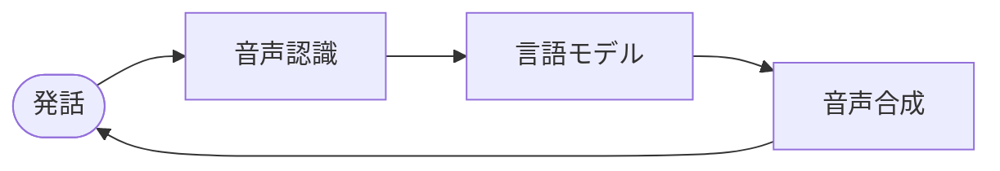

## OneInbox とは

OneInbox は、電話と Web 上で **ライブ音声会話**を処理する AI エージェントを構築するための **音声オーケストレーションプラットフォーム**です。

このドキュメントでは **REST API** と、OneInbox をプロダクトに組み込む方法を説明します。エージェント・モデル・通話を API で設定し、リアルタイム音声・テレフォニー・スケーリングは OneInbox が担当します。

---

## 音声エージェントの仕組み

通話中、次のループが繰り返されます:

| レイヤー | 設定内容 |
| --- | --- |
| **STT** | プロバイダ、モデル、言語 |
| **LLM** | モデル、システムプロンプト、ツール、ナレッジベース |
| **TTS** | プロバイダ、ボイス、速度 |

OneInbox が各レイヤーをリアルタイムで接続します。**エージェントの言動**に集中できます。

| 用語 | 意味 |
| --- | --- |
| **STT**（音声認識） | 発話者の音声をテキストに変換 |
| **LLM**（言語モデル） | エージェントが何と返すかを決定 |
| **TTS**（音声合成） | エージェントのテキスト応答を音声に変換 |

---

## 構築できるもの

- **アウトバウンド** — リードへの発信、リマインダー
- **インバウンドサポート** — 電話番号に着信するとエージェントが応答
- **Web 音声** — OneInbox Web SDK でサイトに音声ウィジェットを埋め込み

---

## はじめに

<CardGroup cols={2}>
  <Card title="クイックスタート" icon="rocket" href="/jp/guides/quickstart">
    3 ステップで最初の音声エージェント（約 15 分）
  </Card>
  <Card title="API リファレンス" icon="code" href="/api-reference/agents/create-agent">
    全エンドポイント（Try It 対応）
  </Card>
</CardGroup>

API キーは [OneInbox ダッシュボード](https://oneinbox-dashboard.vercel.app) で作成・管理します。

---

## 次のステップ

- **[クイックスタート](/jp/guides/quickstart)** — 前提条件、3 ステップ、curl ウォークスルー
- **[仕組み](/jp/concepts/how-it-works)** — 音声パイプラインの説明
- **[エージェント](/jp/concepts/agents)** — STT、LLM、TTS、通話ルール
